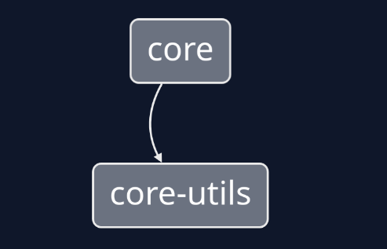

# Monorepo - Example

## How this was created from NX?

Based on docs: https://nx.dev/getting-started/nx-setup

Running: 

```sh
npx create-nx-workspace --preset=core
```

## Inter dependencies

Before, with lerna, we have the `lerna bootstrap`, but without them, how can we merge these inter-deps?

### Install local lib

1. First, enter the `package` you need to have the new dep. e.g(`cd packages/core`).
2. Now, add the exact name and version for your local path, with: `yarn add @example/core-utils@0.0.1 -W`.

**Obs: take a look into the `package.json` for the two packages, their are note private and have `type: module`!.**

## Generate Dependency Graph

Enter the root folder of project and run:

```sh
npx nx graph
```


